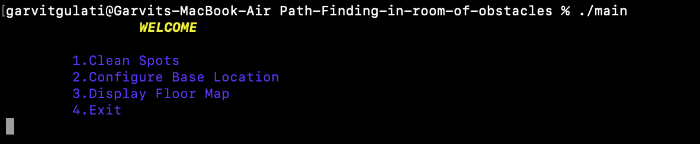
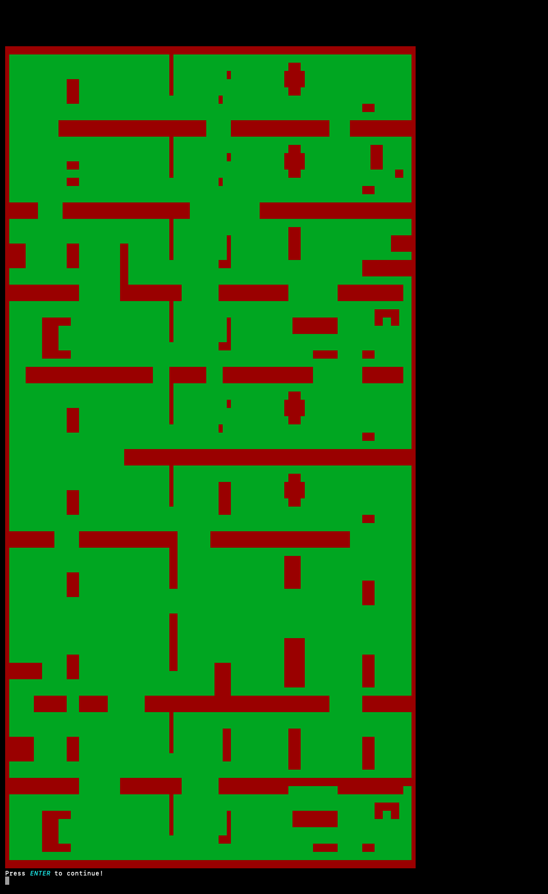
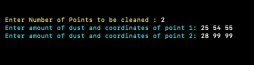
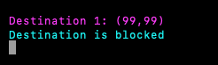
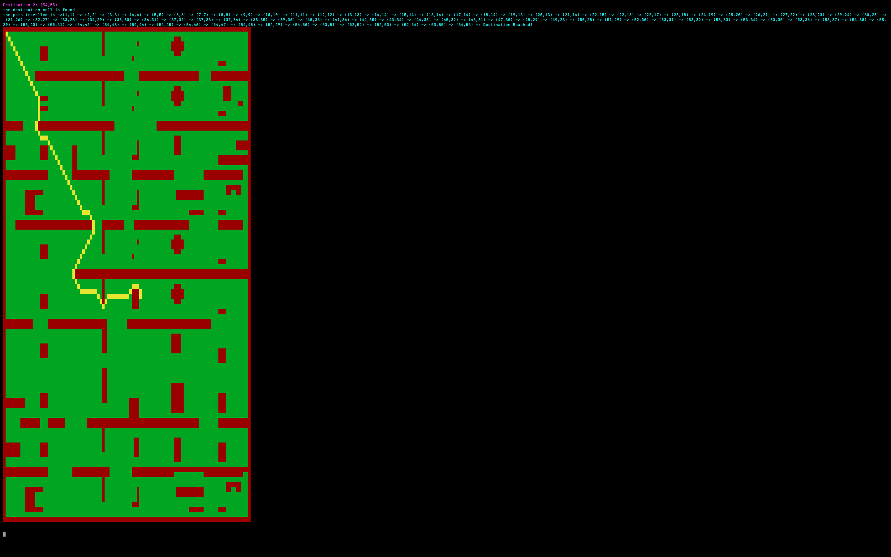
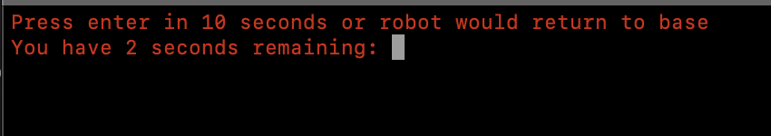

# Path Finding in room of obstacles

In this project i have implemented the A* search algorithm to find path between two points. The given project can be used as a backend engine for house cleaning robots where you feed them the coordinates and amout of dust and it sorts them giving priority to the more dusty points and cleans them by following the path.

## How to run?
Just build the main file in your PC irrespective of the OS. I have used preprocessor directives such that it changes the implementation as per the OS.

## Screenshots

### 1. Homescreen

### 2. Floormap

### 3. Working

